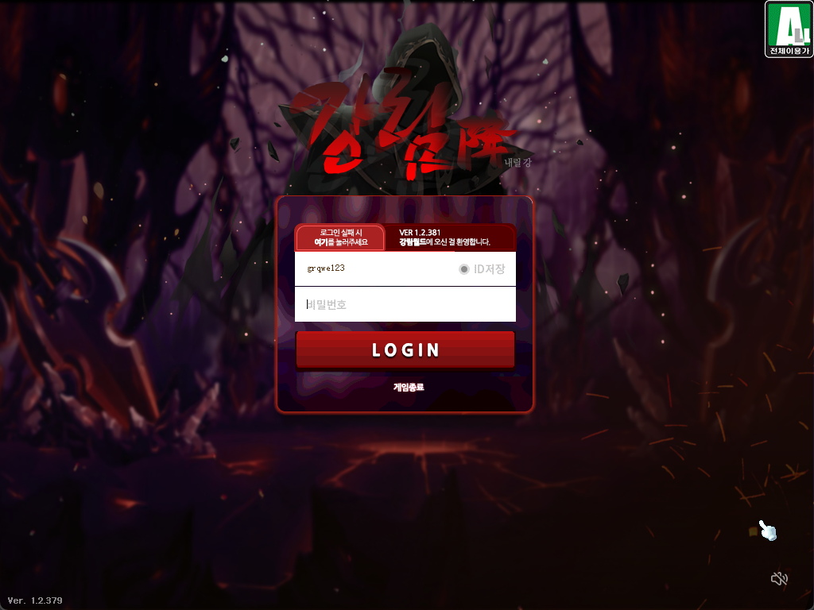

## 说明
1. 本服务端作为单机个人游玩已经非常非常足够了。想体验联机端官方服务器是最佳的选择!
2. 感谢作者的分享，这个端修复的非常非常的完善！BOSS基本已经完全修复。测试过卡琳之前的BOSS全部都可以攻略，剧情也修复了，六转技能也修复了
2. 感谢这位朋友写的教程，下载连接也有：https://www.fengyewuyu.com/forum.php?mod=viewthread&tid=8076
3. 启动需要一个GameLauncher.exe、LREditor。GameLauncher放在了launch文件夹从gms随便找了一个、后面那个github能找到开源的实现。


## 注意事项
1. 大部分是韩文，后续对客户端进行汉化
2. 打BOSS有时候很卡，感觉和电脑性能有关系。
3. 所有文件已经EUC-KR转换成UTF-8格式编码，方便汉化
4. 已修复下线物品丢失问题。


## 启动步骤
1. 下载MariaDB，选择11.8.3。数据库账号密码： 
```
root 123456
注意修改所有数据库地址为localhost
```

2. JDK版本：21
3. 启动服务端，会有个控制台，已部分汉化。
4. 下载客户端 
- 379localhost的文件复制到kms_1.2.381_Ver.0818里面
- 把Gang.dll 改名 Localhost.dll


然后网上找一个GameLauncher.exe(已放在/launch文件夹)。放在文件夹里面
Locale_Remulator
启动方式
1. 点击local_remulator，设置韩语环境
2. Run选择GameLauncher即可


5. 享受你的游戏！



- 账号 grqwe123
- 密码 12345
- 二级密码：随便填没认证